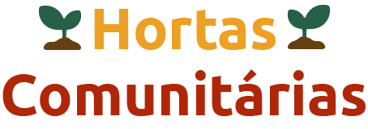

<h1 align="center">
    
</h1>

<p align="center">
  

  
	
  <a href="https://www.linkedin.com/in/larissaiurk/">
    
  </a>

  <a href="https://github.com/larissaiurk/hortas-comunitarias/commits/master">
    
  </a>

  <a href="https://github.com/larissaiurk/">
    
  </a>  
</p>
<p align="center">
<a href="https://insomnia.rest/run/?label=Hortas%20Comuni%C3%A1rias&uri=https%3A%2F%2Fraw.githubusercontent.com%2Flarissaiurk%2Frocketseat-next-level-week-1%2Fmaster%2Fserver%2Finsomnia.json" target="_blank"></a>
</p>

<h1 align="center">PLATAFORMA VIRTUAL PARA HORTAS COMUNITÁRIAS EM CURITIBA</h1>

## :seedling: Projeto Hortas Urbanas Comunitárias

O projeto Hortas Urbanas Comunitárias surgiu durante as aulas na minha faculdade. A primeira parte do projeto foi a documentação do projeto de software disponível em: [projeto-software-hortas-comunitarias-curitiba](https://github.com/larissaiurk/projeto-software-hortas-comunitarias-curitiba). Agora nessa segunda etapa vamos desenvolver uma parte do projeto.

<p align="center">🚧 Backend | 🚧 Backend | 🚧 Mobile </p>


## 💡 Qual parte do projeto será desenvolvida?

Queremos mapear as hortas comunitárias da cidade da Curitiba, com esse cadastro poderemos visualizar os produtos que a horta produz, sua localização e disponibilizar contato por whatsapp e e-mail. Queremos dar mais visibilidades para elas no primeiro momento.


## :rocket: Tecnologias

O projeto utilizou:

- [Node.js][nodejs]
- [TypeScript][typescript]
- [React][reactjs]
- [React Native][rn]
- [Expo][expo]
- [Knex][knex] para migrações

## :information_source: Como usar esse repositório

Basta clonar o repositório e instalar as dependências.

Você vai precisar do [Git](https://git-scm.com), [Node.js][nodejs] + [Npm][npm].

No seu terminal:

### Install API 

```bash
# Clonar o repo
$ git clone https://github.com/larissaiurk/hortas-comunitarias

# Entrar no repo
$ cd hortas-comunitarias/server

# Instalar dependências
$ npm install

# Rodar Migrates
$ npm run knex:migrate

# Rodar Seeds
$ npm run knex:seed

# Copie o arquivo .env e Configure sua url e porta para o servidor
$ cp .env.example .env

# Rodar o servidor
$ npm run dev

```

### Install Front-end

```bash
# Clonar o repo
$ git clone https://github.com/larissaiurk/hortas-comunitarias

# Entrar no repo
$ cd hortas-comunitarias/web

# Instalar dependências
$ npm install

# Rodar
$ npm start

```

### Install Mobile

```bash
# Clonar o repo
$ git clone https://github.com/larissaiurk/hortas-comunitarias

# Entrar no repo
$ cd hortas-comunitarias/mobile

# Instalar dependências
$ npm install

# Rodar
$ npm start

# Quando abrir, baixe o aplicativo Expo, escaneie o QR CODE

# Se tiver problemas com fonte, executar:
$ expo install expo-font @expo-google-fonts/ubuntu @expo-google-fonts/roboto

```

## Próximos passos do projeto

- [ ] Adicionar autenticação - criar cadastro de usuário

## Pacote de ícones

<div>Ícones feitos por <a href="https://www.flaticon.com/br/autores/icongeek26" title="Icongeek26">Icongeek26</a> from <a href="https://www.flaticon.com/br/" title="Flaticon">www.flaticon.com</a></div>

Ícones feitos por <a href="https://www.flaticon.com/br/autores/freepik" title="Freepik">Freepik</a> from <a href="https://www.flaticon.com/br/" title="Flaticon"> www.flaticon.com</a>

## Vetor de pessoas na home 

<a href='https://br.freepik.com/fotos-vetores-gratis/pessoas'>Pessoas vetor criado por freepik - br.freepik.com</a>


---

Feito com ❤️ por Larissa Iurk

[npm]: https://www.npmjs.com/get-npm
[nodejs]: https://nodejs.org/
[typescript]: https://www.typescriptlang.org/
[expo]: https://expo.io/
[reactjs]: https://reactjs.org
[rn]: https://facebook.github.io/react-native/
[knex]: http://knexjs.org/
[materialui]: https://material-ui.com/pt/
